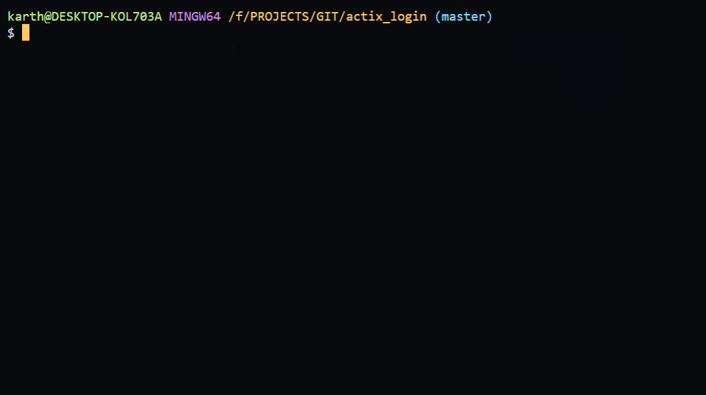
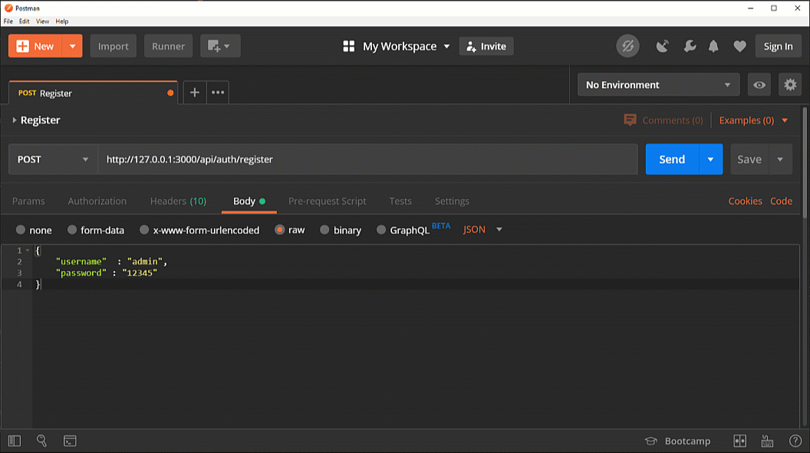

# RUST Actix-Web Login Microservice
RUST, Actix, Login, Bcrypt, Diesel, SQLite

### Description

- Register with username and password
- Login with username and password.Get verified and receive auth cookie
- Update password with auth cookie
- Bcrypt for password hashing
- Sqlite3 embedded db for user database
- Cookie base authentication
- CORS Enabled

### Crate Used

- [actix-web](https://crates.io/crates/actix-web) // Actix web is a simple, pragmatic and extremely fast web framework for Rust.
- [chrono](https://crates.io/crates/chrono) // Date and time library for Rust.
- [diesel](https://crates.io/crates/diesel) // A safe, extensible ORM and Query Builder for PostgreSQL, SQLite, and MySQL.
- [dotenv](https://crates.io/crates/dotenv) // A dotenv implementation for Rust.
- [derive_more](https://crates.io/crates/derive_more) // Convenience macros to derive tarits easily
- [env_logger](https://crates.io/crates/env_logger) // A logging implementation for log which is configured via an environment variable.
- [futures](https://crates.io/crates/futures) // An implementation of futures and streams featuring zero allocations, composability, and iterator-like interfaces.
- [lazy_static](https://docs.rs/lazy_static) // A macro for declaring lazily evaluated statics.
- [r2d2](https:crates.io/crates/r2d2) // A generic connection pool.
- [serde](https://crates.io/crates/serde) // A generic serialization/deserialization framework.
- [serde_json](https://crates.io/crates/serde_json) // A JSON serialization file format.
- [serde_derive](https://crates.io/crates/serde_derive) // Macros 1.1 implementation of #[derive(Serialize, Deserialize)].

## Requirement
```
# SQLite3 
# Ubuntu
$ sudo apt-get install libsqlite3-dev

# windows use vcpkg to install sqlite3

cargo install diesel_cli --no-default-features --features "sqlite-bundled"
```

## Build and Run

```

$ echo "DATABASE_URL=user.db" > .env
$ diesel migration run

$ cargo check 
$ cargo run 

# for arm processor build
$ cargo build --target arm-unknown-linux-gnueabihf --release
```


## Ping
```
curl -i --request GET http://127.0.0.1:3000/api/ping 

# result
pong
```


## Register
```
curl -i --request POST \
  --url http://127.0.0.1:3000/api/auth/register \
  --header 'content-type: application/json' \
  --data '{
        "username": "admin",
        "password":"12345"
}'

# result
HTTP/1.1 200 OK
set-cookie: auth=I7djxyY0IK5eecymVLQYi/WyoIh7m+et95qAnQ3ZQv1Nn8vmWEaf7JrhC2Kub4GRpw==; HttpOnly; Path=/; Domain=localhost; Max-Age=86400
content-length: 0
```


## Login
```
curl -i --request POST \
  --url http://127.0.0.1:3000/api/auth/login \
  --header 'content-type: application/json' \
  --data '{
        "username": "admin",
        "password":"12345"
}'

# result
HTTP/1.1 200 OK
set-cookie: auth=I7djxyY0IK5eecymVLQYi/WyoIh7m+et95qAnQ3ZQv1Nn8vmWEaf7JrhC2Kub4GRpw==; HttpOnly; Path=/; Domain=localhost; Max-Age=86400
content-length: 0
```


## Update Password
```
curl -i --request POST \
  --url http://127.0.0.1:3000/api/auth/update_password \
  --header 'content-type: application/json' \
  --data '{
        "old_password": "12345",
        "password":"123456"
}'

# result
HTTP/1.1 200 OK
set-cookie: auth=FkTMjoBI0crA6PcQ7BNJMoifVP/hLN9WpoySpwG8aplIphxy2aqh9ecPZMSfGCc; HttpOnly; Path=/; Domain=localhost; Max-Age=86400
content-length: 0
```
